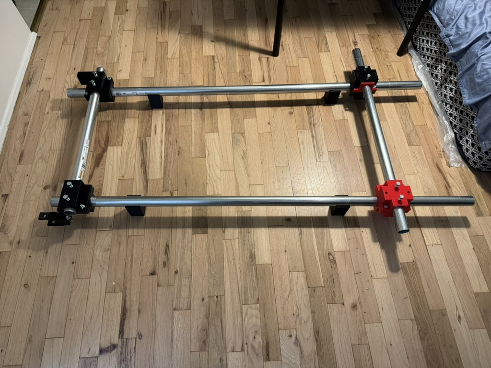
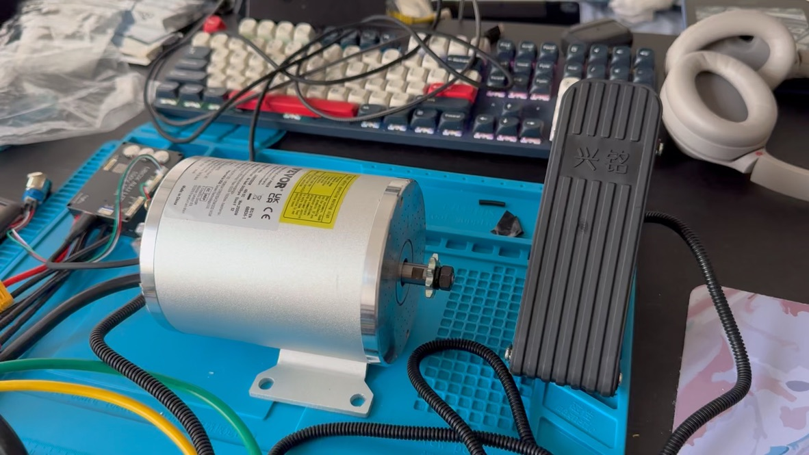
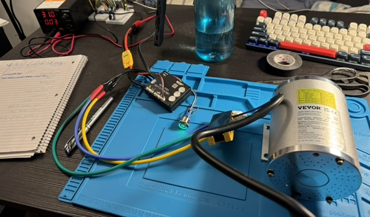

# Electric Go-Kart

A from-scratch electric kart build: custom 3d printed chassis, bldc motor drivetrain, and a VESC-based controller (Spintend Ubox alu lite). Work in progress, started summer 2026.

Using https://makerworld.com/en/models/1629021-go-kart-v1-1-carbon-fiber-tubes-and-nylon-3d-print#profileId-1720255 as inspiration.

## Build log

**Chassis** — Frame prototype built from emt conduit with custom 3D-printed junction nodes at the corners. Nodes are currently affixed by bolt tension. Final revision will use structural epoxy.

**Drivetrain** — 2 kW brushless motor paired with a Spintend VESC-based controller and a hall-effect throttle pedal, sized two 6s battery packs in series providing an effective 12s. 

**Bench test** — Powered test: ran motor detection and pedal setup. Bench test powered by a DC power supply.

