# Electric Go-Kart

I set out to create a electric go kart from scratch may 2026. Its composed of a custom 3d printed chassis and a 2000w bldc mmotor drivetrain controlled by a vesc based Spintend Ubox alu lite motor controller. This is how far ive gotten by the end of summer 2026:

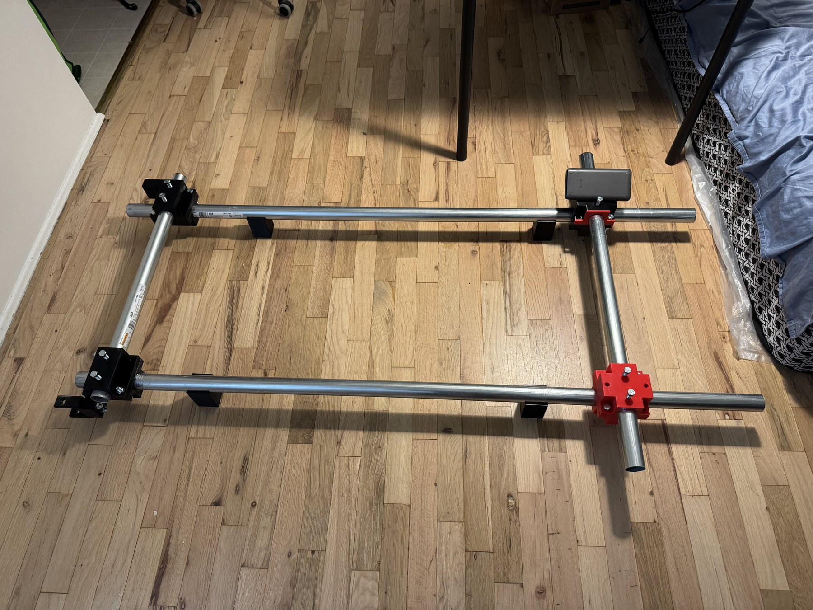

## Contents

- [Inspiration](#inspiration)
- [Frame](#frame)
  - [Node](#node)
  - [Full Assembly](#full-assembly)
- [Powertrain](#powertrain)
  - [Mechanical](#mechanical)
  - [Electrical](#electrical)
    - [Motor](#motor)
    - [VESC](#vesc)
    - [Battery](#battery)
    - [Fuse Selection](#fuse-selection)
- [Parts List](#parts-list)
- [Testing](#testing)

## Inspiration

I used [this MakerWorld model](https://makerworld.com/en/models/1629021-go-kart-v1-1-carbon-fiber-tubes-and-nylon-3d-print#profileId-1720255) as inspiration for my build.

## Frame

frame was made to be modular with the 3d printed node and emt tube as its basic components

### Node

petg node printed in two parts secured together by 3/8 inch x 2 inch bolts. emt tubes are slid through the holes and torqued into place by 3/8 inch bolts securing them rotate and forward back

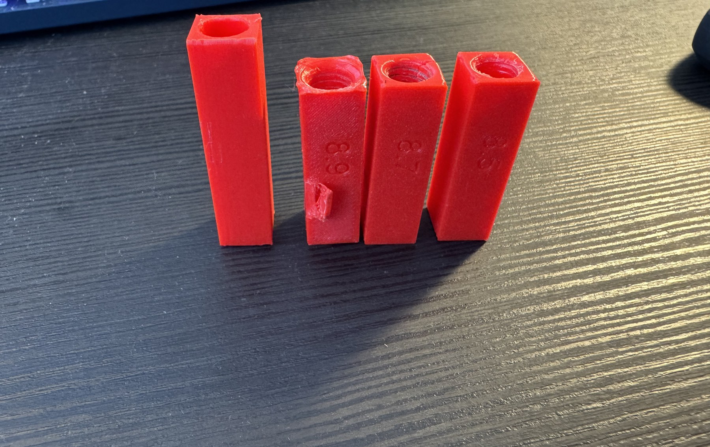
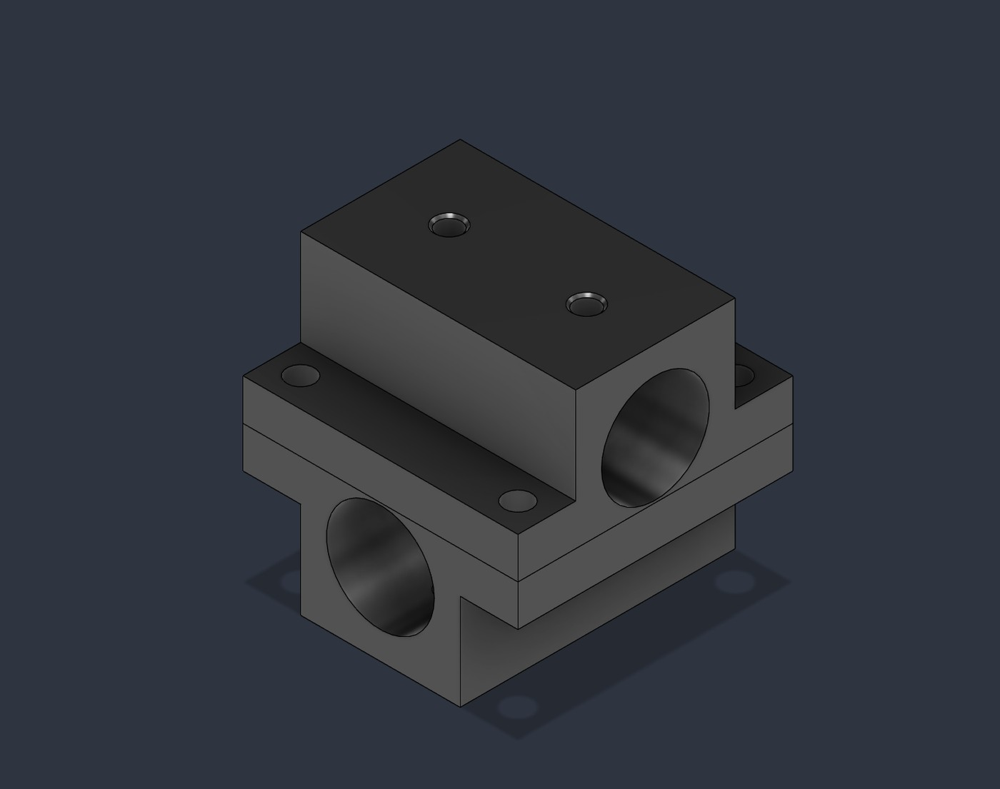

eventual plans after prototyping stage to use structural epoxy such as 3d dp460 in place of bolts dur to plastic creep loosening over time

### Full Assembly

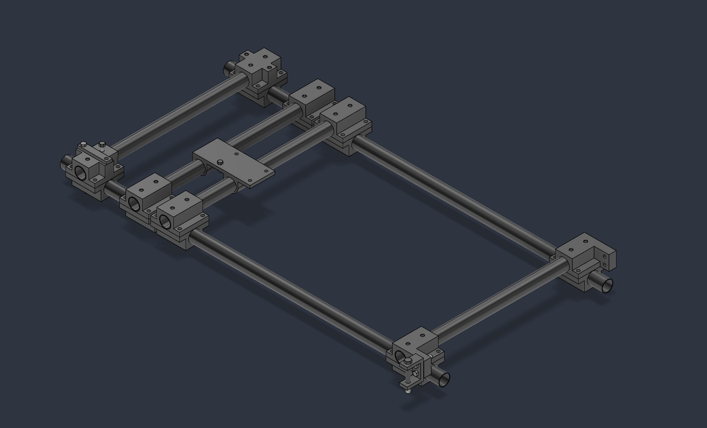

## Powertrain

### Mechanical

| Part | Link |
|---|---|
| Go-kart front steering spindle knuckle & 3-stud hubs | [Amazon.ca](https://www.amazon.ca/dp/B0F2BCW1WR) |
| Hall-effect throttle/brake pedal | [Amazon.ca](https://www.amazon.ca/dp/B07ZRV8H42) |
| labwork 29"/740mm rear live axle kit w/ brake | [Amazon.ca](https://www.amazon.ca/dp/B09JVP29Z1) |
| ExGizmo go-kart steering kit (wheel + rack & pinion) | [Amazon.ca](https://www.amazon.ca/dp/B0GLNG5BTQ) |

I decided on generic Chinese go kart parts for availability off amazon and inexpensiveness. gear and sprocket matched between vevor and rear axle as t8f.

### Electrical

#### Motor

I narrowed my search for a bldc motor down to a my1020, these are everywhere so its both easy to source and inexpensive to buy. Mine came with a mounting plate welded to the bottom as well so its easy to bolt to the rest of the frame.

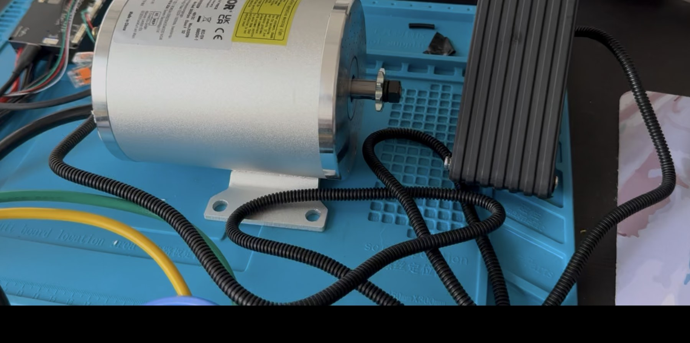
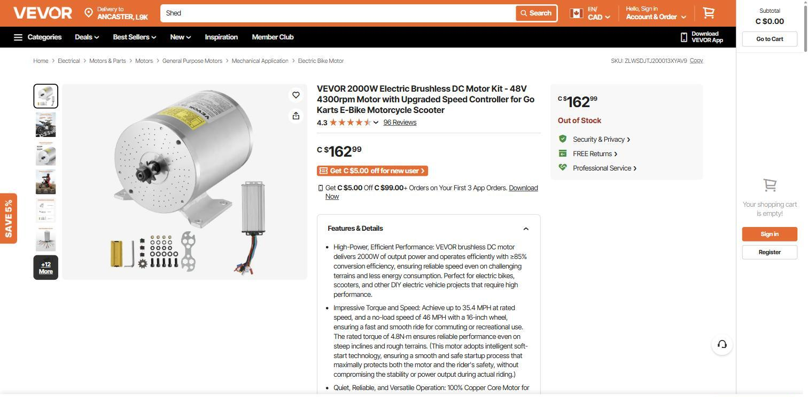

#### VESC

A spintend ubox 100v 100a is likely overkill for my 48v ~35a motor but it has plenty of headroom for future motor upgrades and wont run into any issues due to overloading. I set amperage drawn from battery to a max of 40a to avoid tripping fuse.

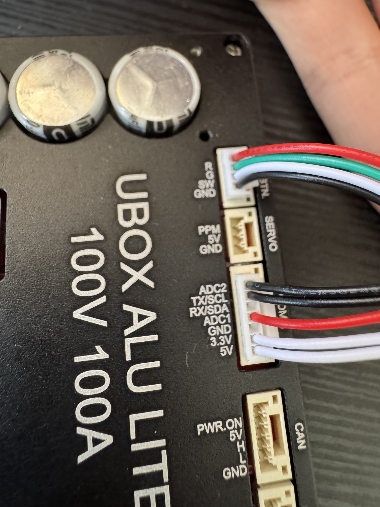

#### Battery

two 6s batteries wired up in series to make 12s. was inexpensive off amazon and read healthy on the balance charger.

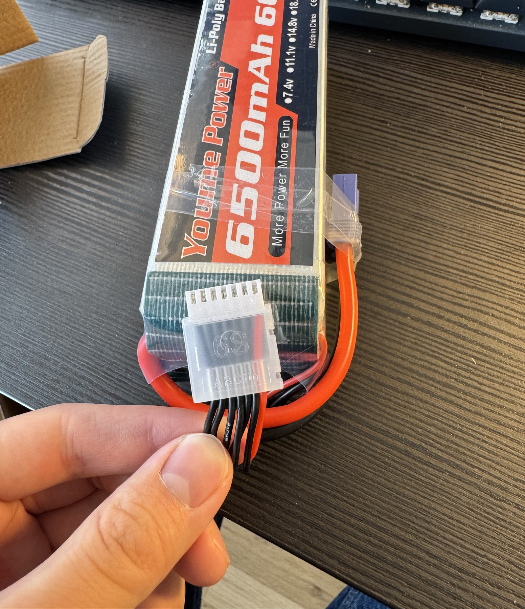
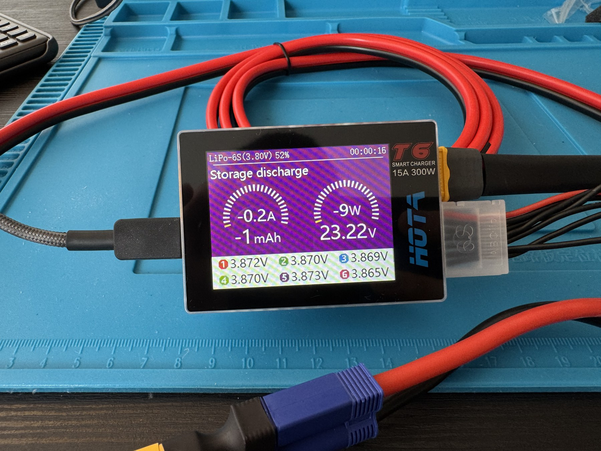

> Editor's note: a handful of reviews on this specific battery listing report cells arriving out of balance or overstated capacity, and there's at least one report of a pack catching fire in storage. Worth checking cell balance on a multi-chemistry / cell checker after every charge and storing packs in a fireproof LiPo bag regardless of what the balance charger says.

#### Fuse Selection

I used the internal resistance of the cells of the balance charger to calculate a maximum short circuit discharge using v=ir. choose this fuse due to having a 2000a rating.

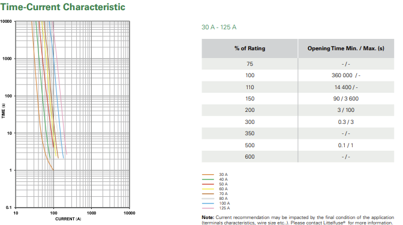

The [142.5631.5602](https://www.digikey.ca/en/products/detail/littelfuse-inc/142-5631-5602/2515917) is a Littelfuse BF1-series 60A/58VDC bolt-down fuse. Per the [BF1 58V datasheet](https://www.littelfuse.com/products/fuses-overcurrent-protection/fuses/automotive-fuses/bolt-down-fuses/midi/bf1-58v/142-5631-5602), fuses in the 40A-150A range of this series (which the 60A covers) carry an interrupting rating of 2000A @ 58VDC, with a typical melting I²t of 16,200 A²s.

## Parts List

| Category | Part | Spec | Price (CAD)* | Source |
|---|---|---|---|---|
| Frame | Iberville 1-1/4" x 10 ft steel EMT conduit | Galvanized steel, 1.51" OD | $49.95 / 10 ft length | [Home Depot](https://www.homedepot.ca/product/iberville-1-1-4-in-x-10-ft-steel-electrical-tubing/1000106371) |
| Mechanical | Qiilu front steering spindle knuckle & 3-stud hubs | For 6" wheels, 78mm hub bolt spacing | $84.64 | [Amazon.ca](https://www.amazon.ca/dp/B0F2BCW1WR) |
| Mechanical | Hall-effect throttle/brake pedal | Vehicle accelerator + brake pedal | ~$18 (this listing is currently unavailable) | [Amazon.ca](https://www.amazon.ca/dp/B07ZRV8H42) |
| Mechanical | labwork 29"/740mm rear live axle kit | T8F 58T sprocket, 24T spline, 159mm brake disc, brake assembly incl. | $124.06 | [Amazon.ca](https://www.amazon.ca/dp/B09JVP29Z1) |
| Mechanical | ExGizmo go-kart steering kit | 300mm wheel, 320mm rack & pinion, adjustable tie rods | $95.99 | [Amazon.ca](https://www.amazon.ca/dp/B0GLNG5BTQ) |
| Electrical | VEVOR 2000W 48V BLDC motor kit | JZ48V2000W, 4300 RPM rated, 5600 RPM no-load, 4.8 N·m | $162.99 (currently out of stock) | [Vevor.ca](https://www.vevor.ca/brushless-dc-motor-c_11227/vevor-48v-2000w-electric-brushless-dc-motor-kit-with-upgraded-speed-controller-p_010120506646) |
| Electrical | Spintend Ubox Alu Lite VESC | 100V / 100A rated | — | — |
| Electrical | Youme Power 6S LiPo, 6500mAh 60C (×2, wired in series for 12S) | 22.2V nominal, EC5 discharge plug | $81.99 each | [Amazon.ca](https://www.amazon.ca/dp/B0B1MMLPPK) |
| Electrical | Littelfuse BF1 142.5631.5602 bolt-down fuse | 60A / 58VDC, 2000A interrupting rating @ 58VDC | $6.89 | [Digikey.ca](https://www.digikey.ca/en/products/detail/littelfuse-inc/142-5631-5602/2515917) |

\*Prices as listed at time of writing (September 2026), before tax/shipping, and subject to change/availability.

## Testing

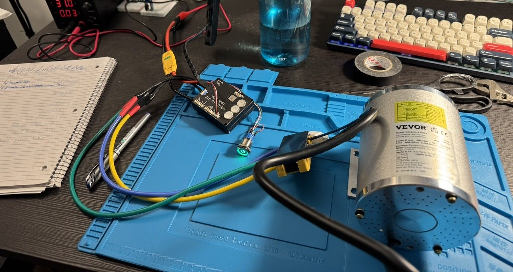
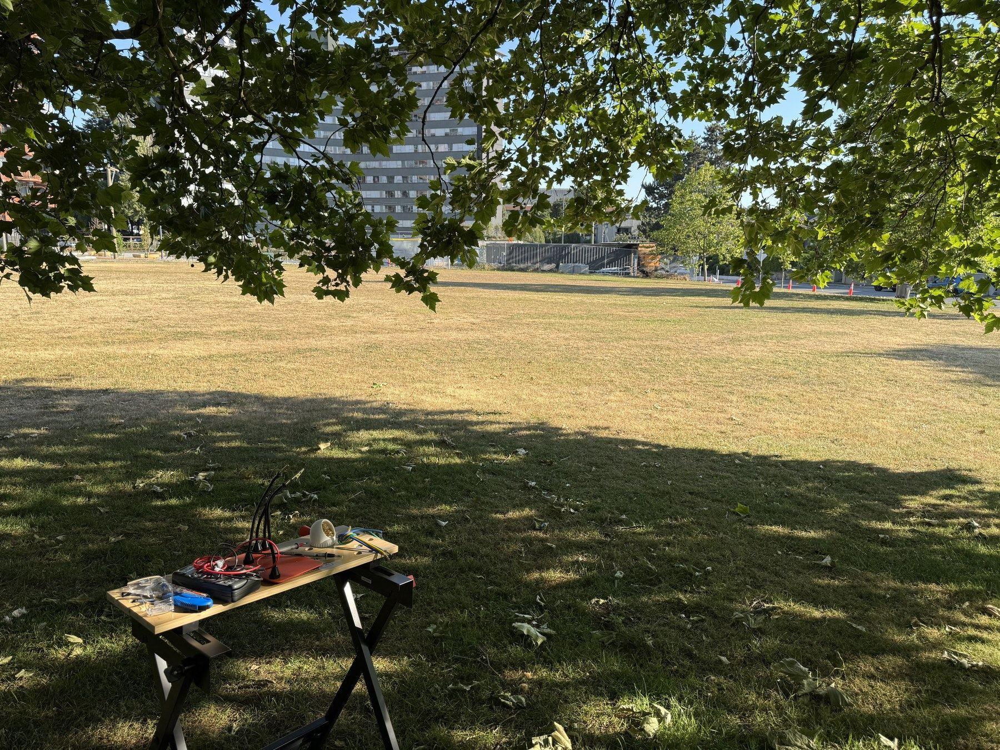
